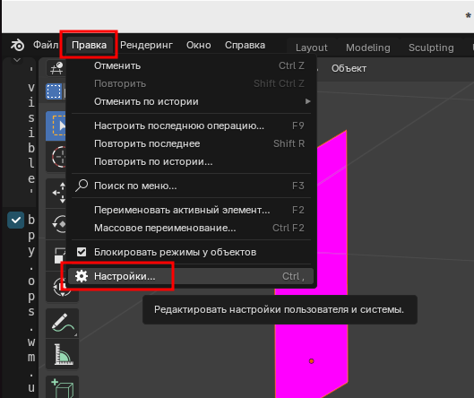
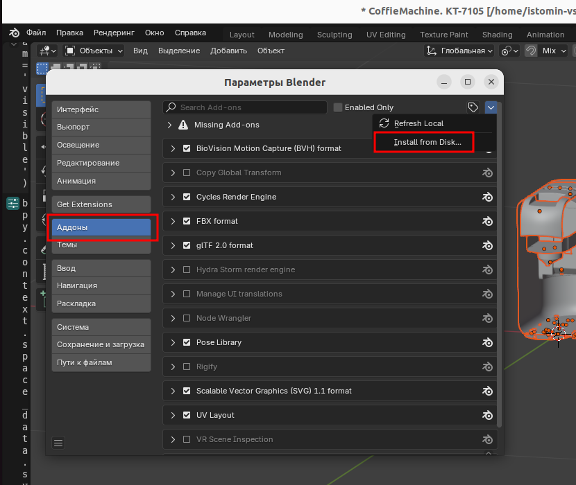
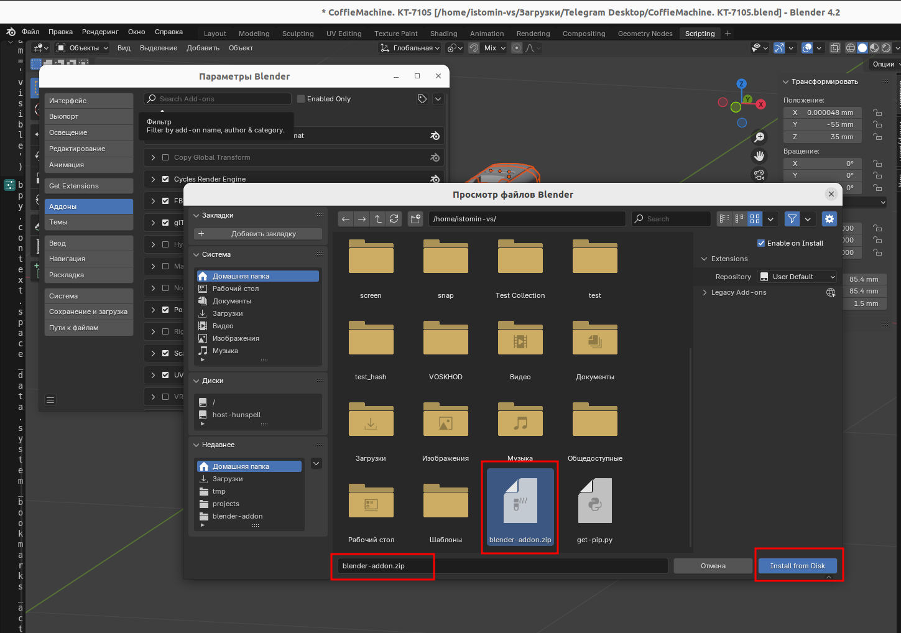
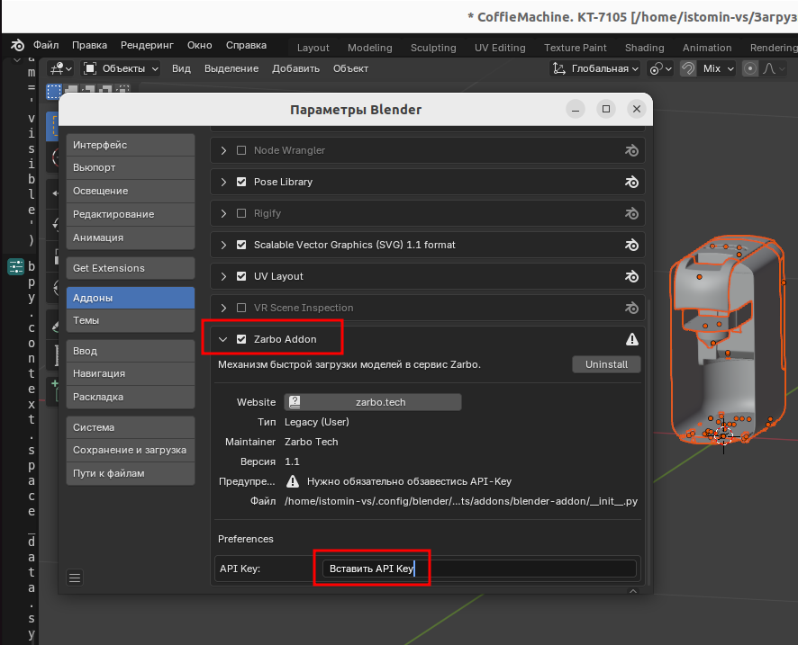
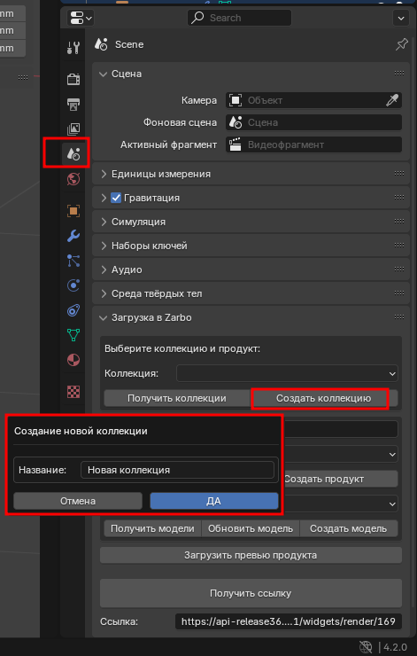
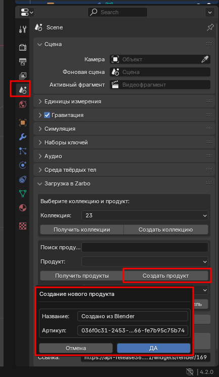
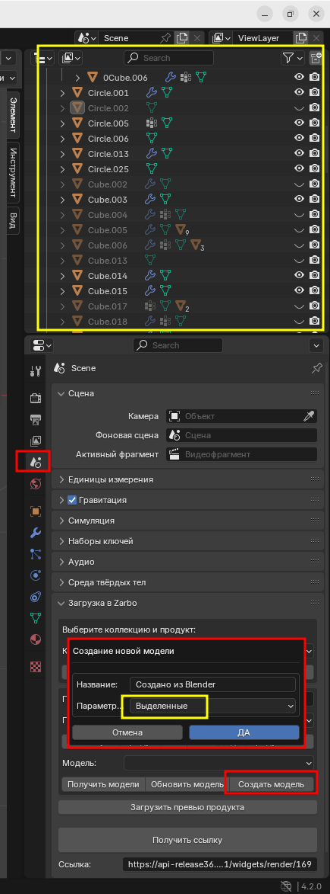

# blender-addon
Addon for Blender 3D

## Содержание

1. [Описание](#описание)
2. [Использование](#использование)
    1. [Установка addon](#установка-addon)
    2. [Быстрый старт](#быстрый-старт)
       
## Описание
Данное расширение позволяет в интерфейсе Blender работать с личным кабинетом Zarbo, а именно:
1. Авторизационный токен хранится в файле Blend-проекта. Это значит, что пока ведется работа над проектом, не нужно будет повторно вставлять авторизационный токен в аддон; 
2. Управлять коллекциями и продуктами коллекций:
   * Создавать коллекции;
   * Создавать продукты;
3. Для простоты поиска нужного продукта, добавили возможность поиска продукта по его названию и артикулу в Zarbo, при этом в Blender отображается превью выбранного продукта. 
4. Управлять 3D моделями продукта Zarbo в интерфейсе Blender:
   * Загрузить новую 3D модель в продукт прямо из Blender;
   * Обновить/заменить 3D модель продукта; 
5. Получить и скопировать ссылку на Zarbo-виджет в буфер обмена устройства. Ссылка на продукт остается не изменной, в случае замены 3D модели, достаточно будет просто обновить страницу с виджетом.
6. Zarbo-виджет по ссылке по умолчанию поддерживает примерку в AR, нет необходимости в дополнительной настройки виджета для просмотра в AR.
## Использование
### Установка addon
1) Переименовать папку addon в **blender-addon**
2) Создать zip архив с папкой blender-addon (папка с проектом)
3) В **UI** блендера необходимо нажать 
   1) **Правка** > **Настройки**  
   
   2) **Аддоны** > **Install from Disk**  
   
   3) Необходимо выбрать архив с Аддоном  
   
   4) Необходимо ввести **API Key**, который можно получить в ЛК  
   
### Быстрый старт
1) Необходимо создать коллекцию  

2) Необходимо создать продукт  

3) Создать модель и выбрать параметр для слоев  

